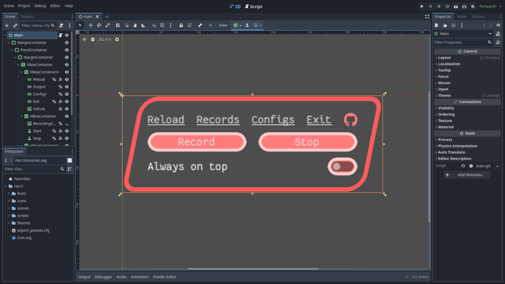

<div style="text-align: center">


# souon
Record a system device audio stream

<a href="#install">Install</a>
<span>&nbsp;&nbsp;-&nbsp;&nbsp;</span>
<a href="#dependencies">Dependencies</a>
<span>&nbsp;&nbsp;-&nbsp;&nbsp;</span>
<a href="#usage">Usage</a>
<span>&nbsp;&nbsp;-&nbsp;&nbsp;</span>
<a href="#build">Build</a>
<span>&nbsp;&nbsp;-&nbsp;&nbsp;</span>
<a href="#troubleshoot">Troubleshoot</a>
<span>&nbsp;&nbsp;-&nbsp;&nbsp;</span>
<a href="#credits">Credits</a>



</div>

### Install
[⮤ Back to top](#souon)

1. Download the binary from the release page ([direct download](#))
2. Make the binary executable
```sh
chmod +x souon
```

### Dependencies
[⮤ Back to top](#souon)

Make sure to have installed the following softwares
- ffmpeg
- pipewire or pulseaudio

### Usage
[⮤ Back to top](#souon)

1. ffmpeg, to be able to record and audio stream, needs a **source device** from which capturing it
	- PulseAudio
		- the command `pactl list short sinks` will lists a short versions of the device available. 
		Copy the id of your main source (the first number).
	- PipeWire
		- the command  `pw-cli` will throw you into a REPL, where the command `list-objects` will list all the available objects. Somewhere will be your main source.
		Copy the object serial.

2. Open the **configuration** file config.cfg
```
cd ~/.local/share/godot/app_userdata/souon/
```

|Config|Default value|Description
|---|---|---|
|id|-1|The device id from which ffmpeg will record the audio stream|
|save_location|/home/$USER/Music|The location (existent) where the file will be saved|
|file_name|output|The name of the file that will prepend the date and time values|
|extension|wav|The extension of the file|
|always_on_top|true|Determines if the window will stay on top of every other window or will succumb|

### Build
[⮤ Back to top](#souon)

1. Clone the repo
```sh
git clone https://github.com/plucafs/souon
```
2. Open Godot, click on the Import button and then select the `project.godot` file
3. Follow these steps:
	- Click on Project
	- Click on Export
	- Click on Add...
	- Select Linux
		- Install the templates (if it's your first export)
	- Click Export project...
	- Select the destination directory


### Troubleshoot
[⮤ Back to top](#souon)

1. Check the [dependencies](#dependencies) list

2. If you click on Recording and the configuration directory is opened, check if the `id` value is  **less** than 0. Should be greater or equal than 0.

### Credits
[⮤ Back to top](#souon)

- Made with [Godot](https://godotengine.org/) 4.3
- Font JetBrains Mono by [JetBrains](https://www.jetbrains.com/lp/mono/)
